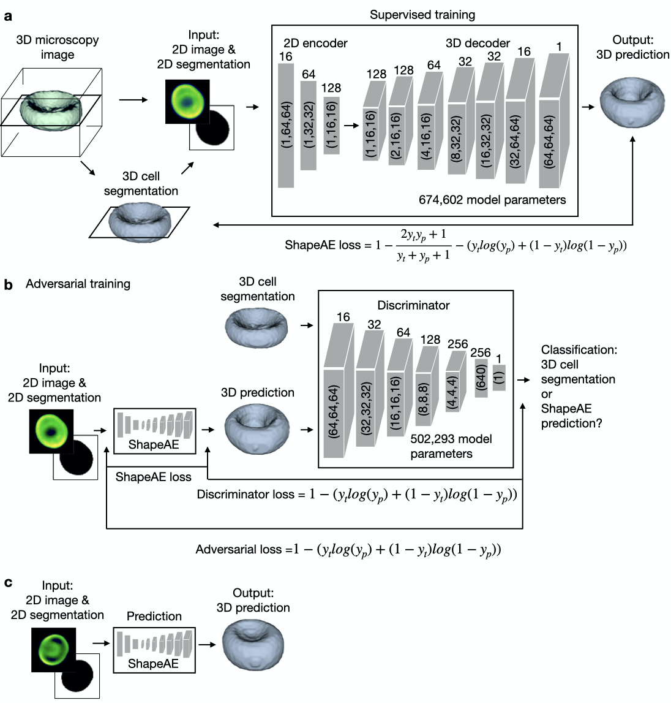

# ShapeAE
<p align="center">

</p>
Reconstructing the shapes of three dimensional (3D) objects from two dimensional (2D) images is a task our brain constantly and unnoticeably performs. Recently neural networks have been proposed to solve the same task and trained to reconstruct the 3D shape of natural objects from 2D photographs. An application to biomedical imaging, where the tradeoff between resolution and throughput is key, is missing so far.
We here show that deep learning can be used to predict the 3D shape of single cells and single nuclei from 2D images and thereby reconstruct relevant morphological information. Our ShapeAE autoencoder is trained with hundreds of 3D shapes and corresponding 2D sections of red blood cells and differentiated induced pluripotent stem cells, and fine tuned with an adversarial network inspired discriminator. We demonstrate the power of our approach by showing that the 3D shapes of red blood cells can be reconstructed more realistically than with simpler 3D models. Moreover, the features extracted from the predicted 3D shapes lead to a higher classification accuracy for six red blood cell types than the features of the 2D image alone. Applied to human induced pluripotent stem cells growing in a 3D culture, we demonstrate that ShapeAE is able to robustly reconstruct the shape of single nuclei from a 2D slice, mimicking a single imaging step. Our work demonstrates that neural networks can learn to reconstruct the 3D shape of single cells and nuclei from 2D images.
ShapeAE is available as an easily installable, well documented python package. Its application allows dramatically increasing throughput for the characterization of cellular and subcellular structures in biomedical imaging data.

please refer to our preprint on bioRxiv 
[here](Link_to_paper.de)


<p align="center">

</p>
ShapeAE enables the prediction of 3D single cell shapes from 2D microscopic images. a, ShapeAE consists of a 2D encoder, which embeds 2D images into a 128 dimensional latent space, and a 3D decoder, which reconstructs the 3D shape from the latent space representation. To train ShapeAE we segment the 3D shapes of single cells (we show an exemplary single red blood cell) from 3D microscopy images and pair them with a 2D segmentation of one slice of the single cell. The 2D slice is accompanied by a microscopy image of the same slice to enter the encoder as input. During training, we minimize the ShapeAE loss, which is the sum of the dice coefficient loss and the binary cross entropy loss. For an input image of 64 x 64 pixels, we provide the pixel sizes for each layer in the gray boxes and the filter sizes on top of each box. b, To finetune ShapeAE we add a discriminator to create a conditional adversarial autoencoder. The discriminator is trained to differentiate between ShapeAE output and the ground truth 3D segmentation and to minimize the adversarial loss. It thereby challenges ShapeAE to output realistic 3D objects. We optimize the parameters of the discriminator and ShapeAE in an alternating fashion. c, The trained ShapeAE model predicts the binary 3D cell shape from 2D image sections.


## Installation:

Fork the repository.

```console
$ cd ShapeAE
$ pip3 install -e .
```

### Installation using a vitual environment:
We would recommend to first set a virtual environment and then install the package:

```console
$ cd shapeae
$ python3 -m venv .venv_shape
$ source .venv_shape/bin/activate
(.venv_shape) $ pip3 install -e .
```
By activating the virtual environment your shell’s prompt will be changed in order to show what virtual environment you’re using.

You can dectivate a virtual environment by:
```console
(.venv_shape) $ deactivate
```

We can also use the virtual environment as a kernel for Jupyter Notebook. First you should install `ipykernel' package when the virtual environment is **activated**:

```console
(.venv_shape) $ pip3 install ipykernel
```

We need to manually add our virtual environment as a kernel to Jupyter Notebook:

```console
(.venv_shape) $ python -m ipykernel install --name=.venv_shapeae
```

Now by openning the Jupyter-Notebook you have the option to select the `.venv_shapeae` as the kernel.

## Installation using pip install:
You can also install ShapeAE using:
```console
pip install shapeae
```

## Running ShapeAE:
Please find an example of how ShapeAE can be run in the /shapeae/docs/jupyter notebook/Run ShapeAE from notebook.ipynb


We have also added example data in /shapeae/docs/sample, which can be used to run ShapeAE
# Setting parameters
To run ShapeAE you should set the following parameters:
Setting parameters are:
- `path`: path to a folder that includes three subfolder of
    1. `obj`: containing the 3D groundtruth segmentations, 
    2. `mask`: containing the 2D masks, 
    3. `image`: containing the images from which the 2D masks were segmented (e.g. brightfield).
- `result_path`: path to a folder for saving the results of predictions.
- `pretrained_weights_path`: path to a folder for saving and reloading pretrain model 
- `random_seed`: seed for random generator in order to keep the results reproducible.

The setting parameters are read from the `settings` object. You may change the setting parameters by directly changing their default values in a `shapeae/config_params.json` file or simply package API like:
```console
> from shapeae import settings
> settings.path = "a/new/path"
```
We have added an example of a config.json file to shapeae/docs/sample/sample_config_params.json. If you want to use it, please adapt the paths to your project and copy the sample_config_params.json to /shapeae/, then execute the /shapeae/run_train_script.py 
You can also print all the parameters and their values using `print()` function:

> print(settings)
------ settings parameters ------
path: "path value"
result_path: "result_path value"
pretrained_weights_path: "pretrained_weights_path value"
random_seed: 0
```

## Running functions:
You can run the training and evaluating on the test sample by calling the `run_train()` and `run_evaluation()` functions respectively.
```console
> from shapeae import run_train
> run_train()
> run_evaluation()
```
## Contributing

We are happy about any contributions. For any suggested changes, please send a pull request to the *develop* branch.

## Citation

If you use ShapeAE, please cite this paper: Link will be inserted soon.

